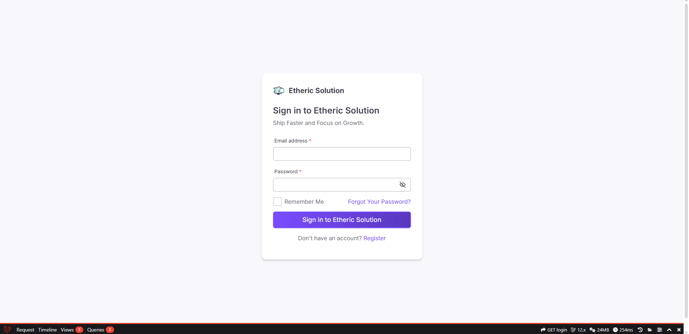
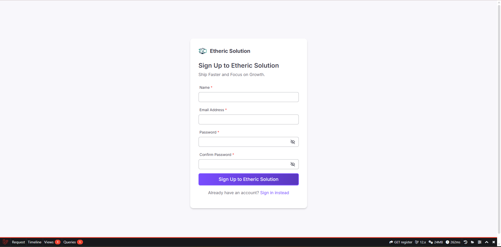
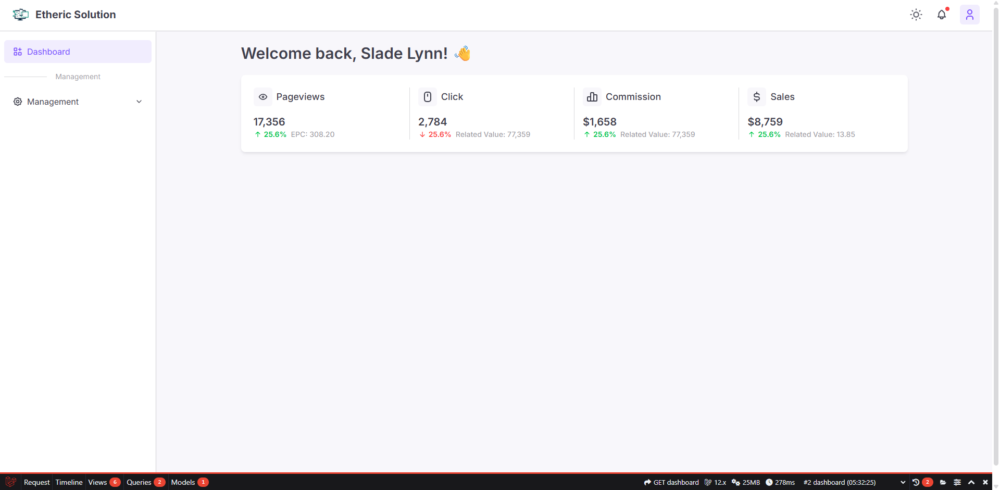
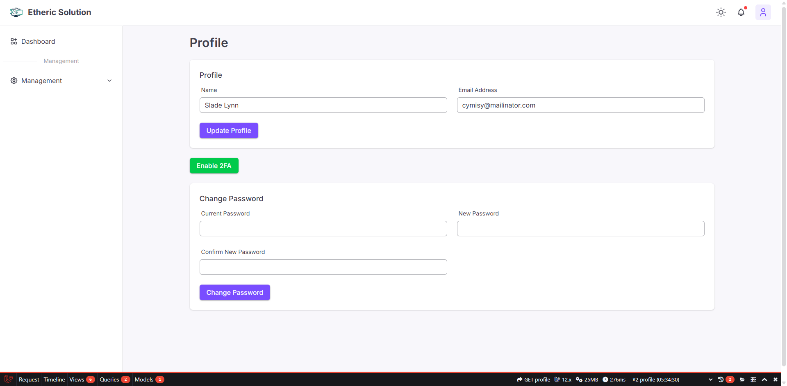

# Laravel Starter Kit

[](https://laravel.com)
[](https://php.net)
[](LICENSE)

A lightweight starter kit for Laravel applications — preconfigured with common packages and sensible defaults to help you get a new project up and running quickly.

Built with: [FlyonUI](https://flyonui.com/) - A modern, lightweight UI library for rapid web development.

## Features

- **Authentication**: Complete user authentication system with Laravel Fortify
- **Two-Factor Authentication**: Built-in 2FA support for enhanced security
- **Email Verification**: User email verification out of the box
- **Modern UI**: Beautiful interface powered by FlyonUI and Tailwind CSS
- **Query Builder**: Advanced API query building with Spatie Laravel Query Builder
- **Debug Tools**: Laravel Debugbar for development debugging
- **Testing**: Pre-configured with Pest for comprehensive testing
- **Code Quality**: Laravel Pint for code formatting and style consistency

## Requirements

- PHP 8.2+
- Composer
- Node.js + npm (or pnpm)
- MySQL, PostgreSQL, SQLite, or another supported database

## Screenshots









## How to use

To create a new Laravel project using this starter kit, run the following command:

```bash
laravel new --using=ethericsolution/laravel-starter-kit
```

## Contributing

Contributions are welcome! Please feel free to submit a Pull Request. For major changes, please open an issue first to discuss what you would like to change.

1. Fork the project
2. Create your feature branch (`git checkout -b feature/AmazingFeature`)
3. Commit your changes (`git commit -m 'Add some AmazingFeature'`)
4. Push to the branch (`git push origin feature/AmazingFeature`)
5. Open a Pull Request

## Support

If you find this project helpful, consider supporting me:

<a href="https://www.buymeacoffee.com/hkmakwana1212" target="_blank">
  
</a>

## License

This project is licensed under the MIT License - see the [LICENSE](LICENSE) file for details.
